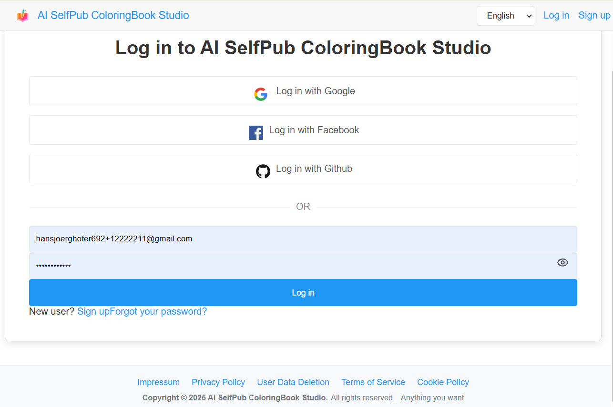
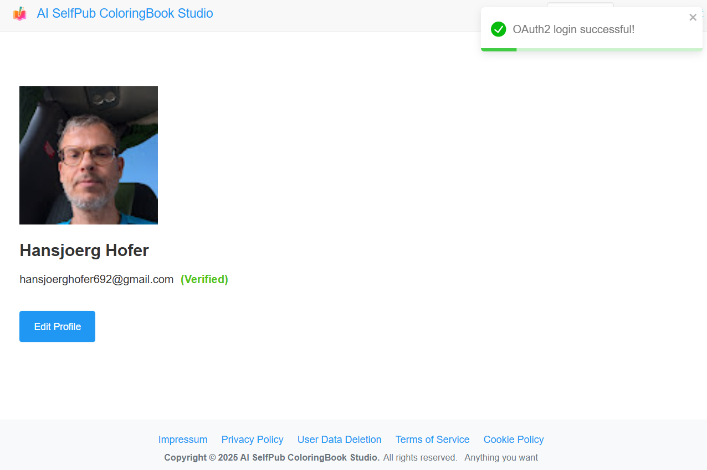

# Spring Boot React OAuth2 Social Login Demo

Original Project updated and extended from
https://github.com/callicoder/spring-boot-react-oauth2-social-login-demo/tree/master/spring-social
https://www.callicoder.com/spring-boot-security-oauth2-social-login-part-1/




## Setting up the Backend Server (spring-social)

## Tech Stack: 
Spring Boot for robust backend,
React for dynamic UI,
JWT for stateless auth,
OAuth2 for social logins,
Liquibase for DB migrations,
i18n for global reach,
Rate Limiting for security).


[Backend README](./coloringbook.backend/README.md)

+ **Run coloringbook.backend**

	```bash
	mvn spring-boot:run
	```

## Setting up the Frontend Server (coloringbook.frontend)

[Frontend README](./coloringbook.frontend/README.md)
```bash
cd coloringbook.frontend
npm install && npm start dev
```